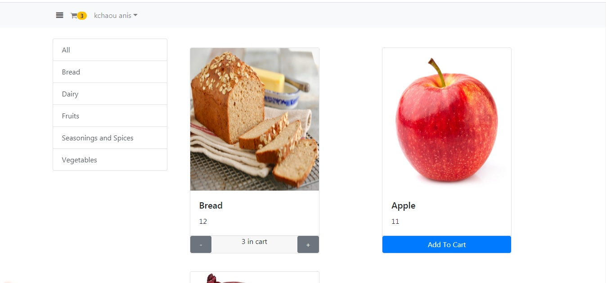
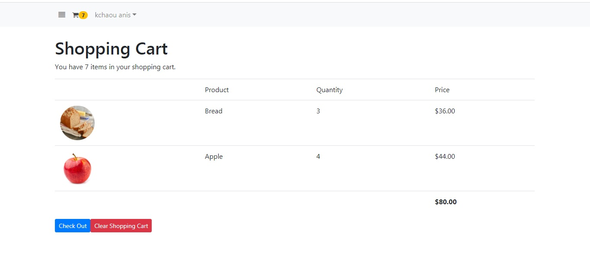
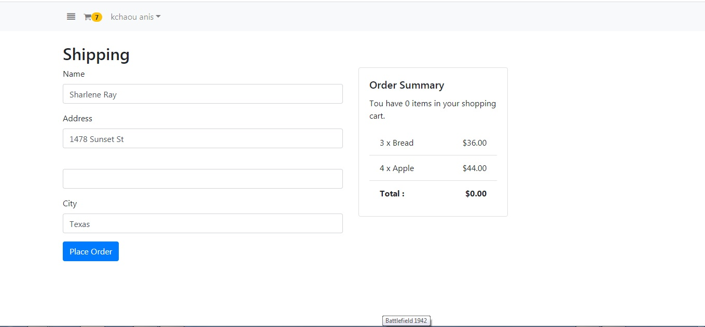
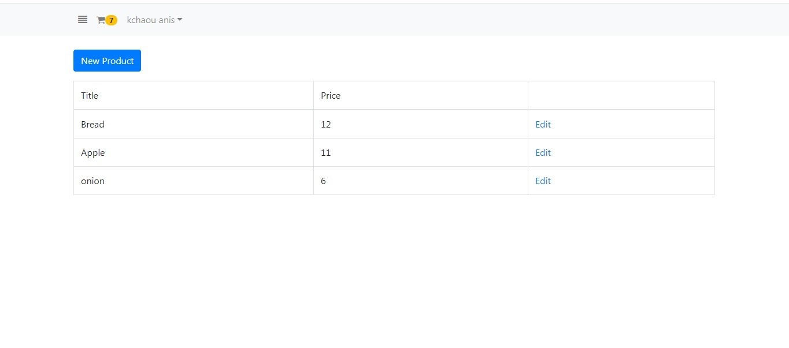

## Objective

  
This project consists of developing a real e-commerce application for an  organic shop using Angular 7, Firebase  (used for authentification and storage of data)  and Bootstrap 4.  
  

## Features

  
  
select  the  category  and  see  all the  products  in that  category.  
Add a product to the shopping cart. (it  change  the quantity and number of items in a shopping cart.)  
check out the  shopping  form and the  summary  of all the  products  in  shopping cart.  
Send the order which it could be visible only by administrator  
The administrator can manage orders and products.  
The authentication and authorization are performed by Gmail of the user.  
  

## Screenshot

 
List of product by category

List of product in  shopping cart

The shipping form

The products management 
  

## technologies
Angular 7, Firebase, Bootstrap 4, font-awesome, REST API